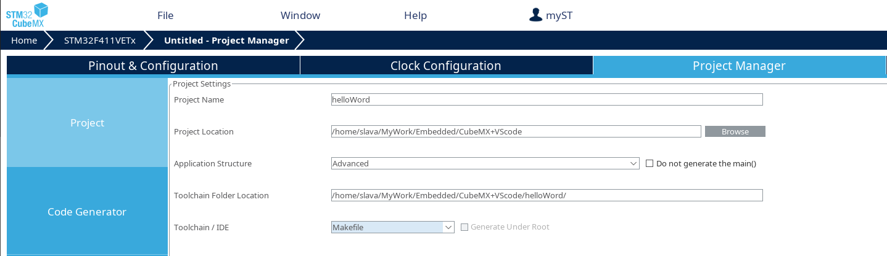
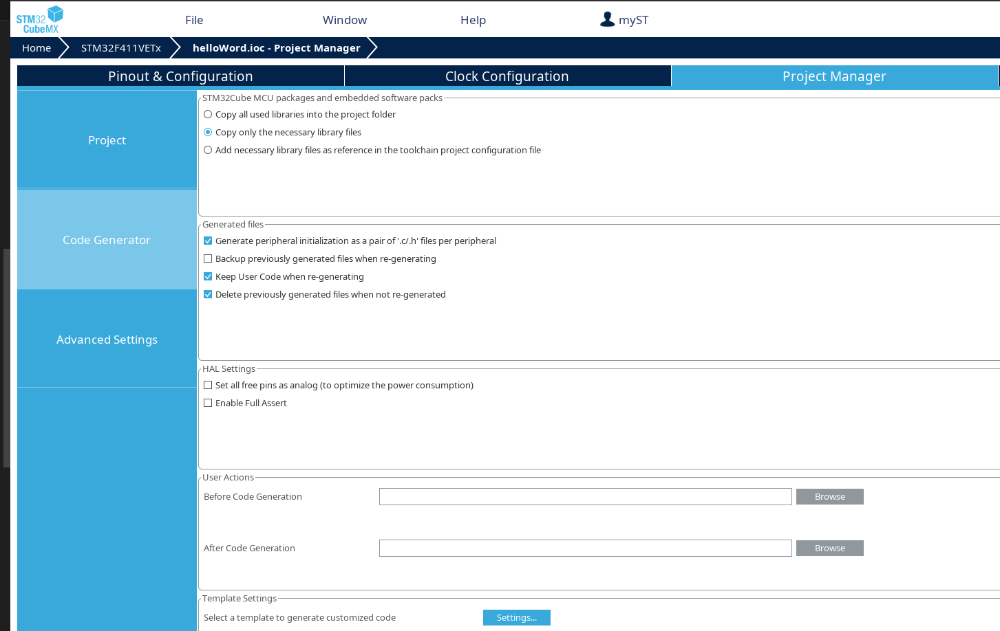

# CubeMX + openOCD + VSCode  

Это памятка по созданию среды разработки для микроконтроллеров семейства STM32 в дистрибутивах GNU Linux с использованием кодогенератора от ST CubeMX и OpenOCD в качестве ПО для программирования и отладки. Используемый дистрибутив - Manjaro Linux версии 23.1.1, отладочная плата STM32F411.

## Установка необходимых пакетов для создания среды разработки  
Нам понадобится установить менеджер пакетов yay:
```
pamac install yay
```

### CubeMX
Чтобы загрузить генератор кода CubeMX, введите в терминале следующую команду:
```
yay -S stm32cubemx
```
Eсли у вас возникли проблемы с установкой yay, то можно воспользоваться AUR.
```
git clone https://aur.archlinux.org/stm32cubemx.git
```

### GCC
Компилятор:
```
pamac install arm-none-eabi-gcc
```

### GDB
Отладчик:
```
pamac install arm-none-eabi-gdb
```

### openOCD
В качестве инструмента для отладки и программирования используется openOCD, для загрузки выполнить:
```
pamac install openocd
```
Также нам понадобится *.svd файл для просмотра регистров во время отладки. Этот файл можно взять с сайта [ST](https://www.st.com/en/microcontrollers-microprocessors/stm32-32-bit-arm-cortex-mcus.html)

Перейдя по ссылке, выберете семейство микроконтроллеров, далее перейдите во вкладку **CAD Resources**, секция **SVD** и скачиваете архив:


В скачанном архиве находится директория *STM32F4_svd_V**, где * версия релиза. Сохраняете ее в удобном для вас месте.

## Создание проекта в CubeMX
Самый простой способ получить заготовку проекта - собрать его в CubeMX. Сконфигурируем проект и добавим пин отладочного интерфейса для мигания светодиодом. Далее необходимо выполнить несколько обязательных пунктов:
- Во вкладке **Project** 
    - Необходимо выбрать в качестве *Toolchain / IDE* Makefile, это нужно для того, чтобы мы смогли собирать наш код в консоли без использования IDE.  
    

    - Также нам понадобится пакет прошивки для микроконтроллера STM32F4, его можно получить с официального репозитория, предоставляемого ST.  
    Ссылка на репозиторий, если вам хочется узнать больше информации:
        ```
        https://github.com/STMicroelectronics/STM32CubeF4
        ```

        Или вы можете сразу клонировать репозиторий:
        ```
        git clone --recursive https://github.com/STMicroelectronics/STM32CubeF4.git
        ```

        Для упрощения настройки проекта в CubeMX это можно сделать в расположение хранения по умолчанию:
        ```
        /home/<username>/STM32Cube/Repository/
        ```
        
        
        Если вы выбрали свое расположение хранения, то не забудьте снять галочку с *Use Default Firmware Location* и указать расположение прошивки.

- Во вкладке **Code Generator** рекомендуется, но не обязательно выбрать следующие 2 пункта:
    - *Copy only the necessary library files*. Это для того, чтобы добавлять в проект только необходимые библиотеки.
    - *Generate peripheral initialization as pair of '.c/.h' files per peripheral*. Это увеличит читаемость кода, т.к. каждый периферийный модуль микроконтроллера будет инициализироваться не в *main.c*, а в своем файле.
    

## Загрузка прошивки из консоли
В директории проекта должно находится примерно следующее:
```
Core  Drivers  helloWord.ioc  Makefile  startup_stm32f411xe.s  STM32F411VETx_FLASH.ld
```

Для проверки сгенерированного кода CubeMX-ом, добавим мигание светодиодом в *Core/Src/main.c*:
```C
/* USER CODE BEGIN WHILE */
  while (1)
  {
    HAL_GPIO_TogglePin(GPIOD, GPIO_PIN_13);
    HAL_Delay(100);
    /* USER CODE END WHILE */

    /* USER CODE BEGIN 3 */
  }  
``` 
Далее выполним сборку нашего проекта. Необходимо находится в директории, где расположен *MAkefile* и выполнить команду:
```
make all
```
Переходим в директорию *build* или указываем путь до *filename.elf* / *filename.hex* / *filename.bin* относительно того места, где мы находимся. 

- В общем виде команда загрузки через готовый конфиг выглядит следующим образом:
    ```
    openocd -f board/stm32f4discovery.cfg -c "program filename.elf verify reset exit"
    ```
    - **board/config.cfg** - тут располагаются готовые конфигурационные файлы для работы с конкретной отладочной платой / микроконтроллером.
    - **filename.elf/.hex/.bin** - загружаемая прошивка микроконтроллера.
    - **verify** - 
    - **reset** - 
    - **exit** - 

- Для загрузки нашей прошивки на микроконтроллер, представленной как *filename.elf* необходимо выполнить команду:
    ```
    openocd -f board/stm32f4discovery.cfg -c "program filename.elf verify reset exit"
    ```

- Для загрузки нашей прошивки на микроконтроллер, представленной как *filename.hex* необходимо выполнить команду:
    ```
    openocd -f board/stm32f4discovery.cfg -c "program filename.hex verify reset exit"
    ```

- Для загрузки нашей прошивки на микроконтроллер, представленной как *filename.bin* требуется передать адрес начала flash памяти. Выполнить команду:
    ```
    openocd -f board/stm32f4discovery.cfg -c "program helloWord.bin exit 0x08000000 reset exit"
    ```       

## Отладка прошивки из VSCode 
Сначала необходимо дополнить Makefile - добавить цель program, добавим ее перед целью *clean*. Наши изменения Makefile-а не будут утеряны в случае изменения проекта в CubeMX.

```M
#######################################
# program
#######################################
program: $(BUILD_DIR)/$(TARGET).elf
	openocd -f board/stm32f4discovery.cfg -c "program build/$(TARGET).elf verify exit reset"
```

Далее переходим в директорию проекта. В директории проекта создаем директорию *.vscode*. В директории *.vscode* создаем два файла:

- **tasks.json** - В этом файле объявляются три задачи: сборка нашего проекта, очистка директории *build* и загрузка прошивки на микроконтроллер.
    ```Json
    {
        "version": "2.0.0",
        "tasks": [
            {
                "label": "Build",
                "type": "shell",
                "group": "build",
                "command": "make all",
                "problemMatcher": []
            },
            {
                "label": "Clean",
                "type": "shell",
                "group": "build",
                "command": "make clean",
                "problemMatcher": []
            },
            {
                "label": "Run",
                "type": "shell",
                "command": "make program",
                "problemMatcher": []
            }
        ]
    }
    ```
    - **label** - команда, выбранная в Run Task....
    - **type** - тип команды (shell - выполняется в командной оболочке).
    - **command** - команда выполняемая в оболочке.
    - **group** - установка данной команды как сборки по умолчанию, позволяет запускать сборку по нажатию сочетания клавиш *CTRL + SHIFT + B*.  
Более подробно изучить поля и создание *tasks.json* файлов можно на официальном сайте Visual Studio Code в разделе **DOCS** -> **USER GUIDE** -> **Tasks**.

- **launch.json** - В этом файле создается конфигурация запуска, для сценария отладки.
    ```Json
    {
	    "version": "0.2.0",
	    "configurations": [
	    	{
	    		"name": "openocd(debug)",
	    		"cwd": "${workspaceRoot}",
	    		"executable": "./build/${workspaceFolderBasename}.elf",
	    		"type": "cortex-debug",
	    		"request": "launch",
	    		"servertype": "openocd",
	    		"svdFile": "/home/slava/MCU_Tools/svdConfigSTM32/STM32F4_svd_V1.9/STM32F411.svd",
	    		"configFiles": [
	    			"board/stm32f4discovery.cfg"
	    		],
	    		"preLaunchTask": "Build"
	    	}
	    ]
    }
    ```
    - **name** - название, которое будет отображаться в окне *RUN AND DEBUG*.
    - **cwd** - директория с проектом.
    - **executable** - расположение elf файла.
    - **type** - расширение для конфигурации.
    - **request** - тип конфигурации.
    - **servertype** - сервер отладки.
    - **svdFile** - расположение *.swd файла для вашей отладочной платы / микроконтроллера
    - **configFiles** - флаги передаваемые openOCD
    - **preLaunchTask** - запуск задачи сборки проекта, описанной в *tasks.json*.  
Более подробно изучить поля и создание *tasks.json* файлов можно на официальном сайте Visual Studio Code в разделе **DOCS** -> **USER GUIDE** -> **Debugging**.

Самое важное - необходимо сообщить VSCode, где располагаются программы openocd и gdb (указать не пути к директориям с ними, а именно сами программы). Сделать это нужно в глобальном файле settings.json. Этот файл располагается в:
```
/home/<username>/.config/Code/User/settings.json
```
Также его можно открыть непосредственно из VSCode. Необходимо перейти во вкладку **File** -> **Preference** -> **Settings** и нажать на отметку, показанную ниже:


- **settings.json**
    ```Json
    {
        "cortex-debug.armToolchainPath": "usr/bin",
        "cortex-debug.openocdPath": "/usr/bin/openocd",
        "cortex-debug.gdbPath": "/usr/bin/arm-none-eabi-gdb",
    }
    ```
    - **cortex-debug.armToolchainPath** - путь к директории в которой располагается *arm-none-eabi-gcc*.
    - **cortex-debug.openocdPath** - полный путь к бинарнику *openocd*.
    - **cortex-debug.gdbPath** - полный путь к бинарнику *arm-none-eabi-gdb*.

Конфигурирование необходимых файлов завершено. Для примера на *HAL_GPIO_TogglePin(GPIOD, GPIO_PIN_13);* поставим точку останова. Далее переходим в **Run and Debug** и запускаем режим *debug*, нажав на отметку зелёного треугольника. Также режим *debug* можно запустить клавишей *F5*.


## Загрузка прошивки из VSCode
Для загрузки прошивки на микроконтроллер мы ранее создали задачу *Run* в *task.json*, теперь для вызова этой задачи добавим сочетание клавиш:
-  Сначала обратимся к командам задач с помощью сочетания клавиш *Ctrl+Shift+P*. Фильтруем список задач по нашей команде «Tasks» и наблюдаем различные команды, связанные с задачей по фильтру. Нам необходима команда *Run Task*, выбираем ее и нажимаем на отметку настроек:

    

- В появившемся меню нас интересует столбец *Keyblinding*, вносим желаемое сочетание клавиш (в данном примере это *Ctrl+Shift+R*):
    

Тепреь при вызове сочетанием клавиш *Ctrl+Shift+R* появится следующее меню, для осуществления загрузки прошивки на микроконтроллер необходимо выбрать *Run*:  


А задача сборки и очистки по умолчанию, выполняются сочетанием клавиш *Ctrl+Shift+B*.

## Добавление в рабочую область исходных и заголовочных файлов
Для примера создадим директорию *myLib* с директориями *mySrc*, *myInc* внутри. Создадим исходный файл *mySrc.c* и заголовочный *myInc.h*. В исходном файле создадим определение функции переключения светодиода:
```C
void myHAL_GPIO_TogglePin (){
    HAL_GPIO_TogglePin(GPIOD, GPIO_PIN_12);
}
``` 
В заголовочном файле создадим объявление функции:
```C
void myHAL_GPIO_TogglePin();
``` 

Далее необходимо указать *Makefile-y* на новые файлы. Сначала добавляем наш исходный файл *mySrc.c* в конец списка исходных файлов:
```M
######################################
# source
######################################
# C sources
C_SOURCES =  \
...
myLib/mySrc/mySrc.c
```

Далее указываем директорию с заголовочным файлом:
```M
# C includes
C_INCLUDES =  \
...
-ImyLib/myInc
```

Переходим в *Core/Src/main.c*, подключаем заголовочный файл нашей библиотеки:
```C
/* USER CODE END Header */
/* Includes ------------------------------------------------------------------*/
#include "main.h"
#include "gpio.h"
#include "myInc.h"
```

Теперь можно вызывать нашу функцию *myHAL_GPIO_TogglePin()* :
```C
 while (1)
  {
    HAL_GPIO_TogglePin(GPIOD, GPIO_PIN_13);
    HAL_Delay(100);
    myHAL_GPIO_TogglePin();
    HAL_Delay(100);
    /* USER CODE END WHILE */

    /* USER CODE BEGIN 3 */
  }
```

## Trableshooting
- **Configured debug type 'cortex-debug' is not supported**.  
Если используете файл *launch.json*, показанный выше, то установите разрешение **Cortex-Debug** в *VSCode*.