# Программаторы

Это памятка по восстановлению, устранению ошибок программаторов. Также рассматривается работа с ними.
Используемый дистрибутив - Manjaro Linux версии 23.1.1, отладочная плата STM32F4Discovery.

## Используемые наборы инструментов для программирования и отладки устройств и плат STM32
Для загрузки прошивки на отладочную плату используется набор инструментов *stlink*, для загрузки выполнить:
```
sudo pacman -Sy stlink
```
Более подробно с этим набором инструментов можно ознакомиться в репозитории [stlink](https://github.com/stlink-org/stlink/tree/testing).

## Обновление прошивки ST-Link

### ST-Link V2
ST-Link V2 представляет собой китайский клон ST-Link-а. Ниже приведено его фото:


Внутри программатора вместо оригинального контроллера STM32F103CBT6 стоит китайский клон - Geehy APM32F103CBT6: 

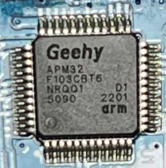


### Подключение ST-Link V2 к отладочной плате STM32F4Discovery
Проверку программатора ST-Link V2 для отладочной платы будем осуществлять путем использования проверяемого программатора в качестве внешнего загрузчика прошивки для отладочной платы STM32F4Discovery.

Рассмотрим схему подключения внешнего программатора к отладочной плате:\
На плате STM32F4Discovery имеется 6-контактный разъем swd для подключения внешних микроконтроллеров. Распиновка этого разъема на плате продемонстрирована ниже:

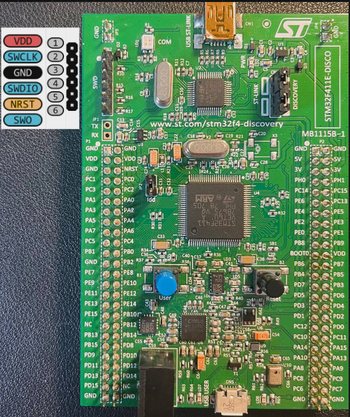

Внешний программатор ST-Link V2 имеет 10-контактный разъем IDC. Распиновку этого разъема можно найти на корпусе программатора. Но рекомендую снять корпус и проверить подписи разъемов на самой плате, так как встречаются программаторы у которых распиновка, напечатанная на корпусе, не соответствует действительности.

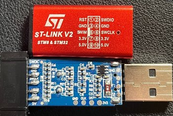

Так как данный программатор предназначен для работы с STM32 и STM8, то не все контакты нам понадобятся. Поэтому для работы с STM32 нам нужны пины:\
*SWDIO*, *GND*, *SWCLK*, *3.3V*.

Соединяем пины программатора с пинами 6-контактный разъем swd на отладочной плате следующим образом:\
*SWDIO* (2) -> *SWDIO* (4)\
*GND* ⠀ (4) -> *GND* ⠀ (3)\
*SWCLK* (6) -> *SWCLK* (2)\
*3.3V*⠀(10) -> *3V* (Подключается к пину *3V* для питания отладочной платы)

Ниже приведено фото для пояснения:

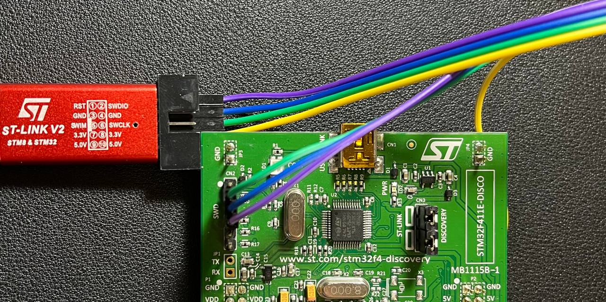


### Проблема
Для того, чтобы получить информацию о подключенном программаторе и целевом MCU введем в терминале команду:
```Console
st-info --probe
```
Результат команды:

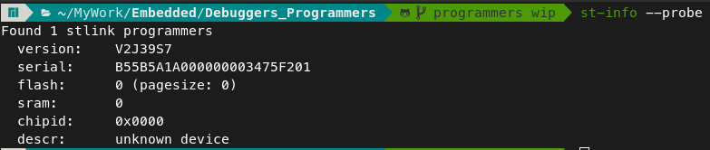

Видим, что программатор не может получить информацию о микроконтроллере.\
Обратим внимание на версию прошивки - **V2J39S7**,\

### Обновление прошивки в ОС Windows

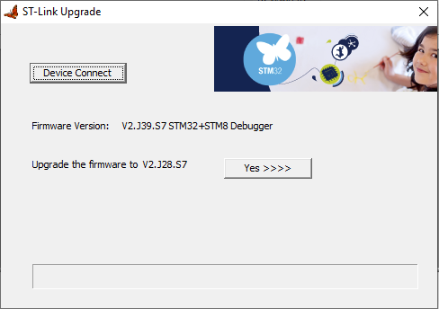
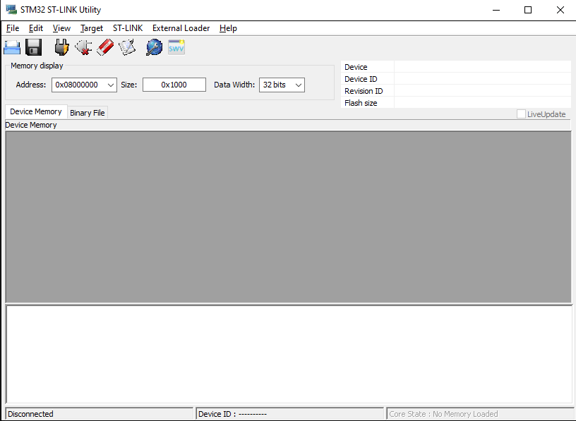
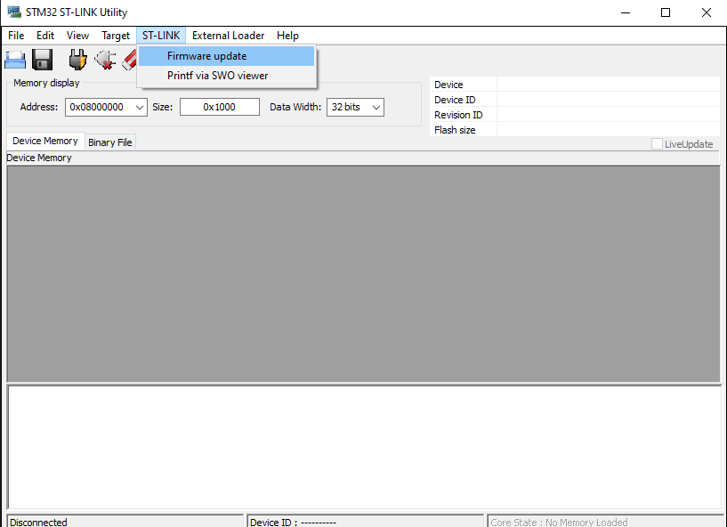
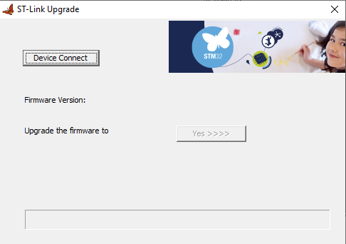
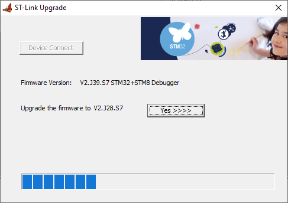
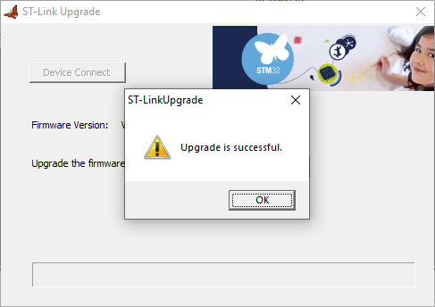

Обновление прошивки - https://uchet-jkh.ru/i/kak-prosit-st-link-v2/

### Обновление прошивки в ОС Linux

### Результат 

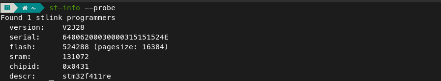


## Доработка ST-Link v2: добавление интерфейса вывода отладочной информации SWO и ноги Reset

Распайка - https://habr.com/ru/articles/402927/
Проблема отсутсвия swo - https://habr.com/ru/articles/749474/

## Перепрошивка ST-Link V2 в ST-LinkV2.1

https://github.com/GMMan/st-link-hack


## Перепрошивка ST-Link в J-link

